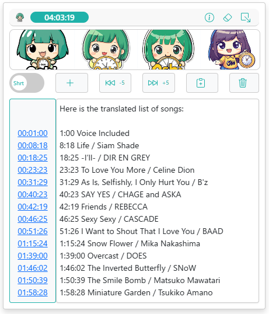

# OSHIStamp: YouTube Video Timestamp Creation Support Tool

[日本語](README.md) | [English](README-EN.md)

A free tool to assist in creating timestamps for YouTube videos.

Not only can you easily create and edit timestamps with intuitive operations, but advanced users can also perform speedy tasks using shortcut keys.

We help make your "Oshi" activities more enjoyable and convenient. Please make use of it!

## Screen Image

## Main Features

- **Add Timestamps**

  Just click the "+" button while watching to add the current timestamp.

- **Change Timestamp Format**

  You can choose between the following two formats for timestamps:

  - Short format (e.g., 2:30, 1:45:15)
  - Full format (e.g., 00:02:30, 01:45:15)

  ※ When adjusting by ±1 second with shortcut keys, the selected format is applied.

- **Jump from Timestamps**

  Clicking on a timestamp link will move the video to that time.

- **Fast Forward and Rewind**

  You can skip in 5-second increments with buttons and in 1-second increments with shortcut keys.

- **Video Screenshot**

  You can download a screenshot of the video in "PNG format."

- **Copy Timestamps**
  You can copy the created timestamps to the clipboard with one click.

- **Check Playback Time**

  You can check the playback time of the video in real-time on the screen.

- **Auto-Save Feature**

  Timestamps are automatically saved to local storage, so you don't have to worry about losing data during work.

- **Display Favorite Images**

  By uploading and displaying your favorite images on the screen, you can boost your motivation for "Oshi" activities!
  (Supported size:530px × 70px, formats: JPG, PNG, SVG)

- **Minimize Feature**

  You can minimize the screen to the bottom right when not needed.

## Shortcut Keys（CTRL + SHIFT or ALT）

- **CTRL + SHIFT/ALT + S**: Add timestamp
- **CTRL + SHIFT/ALT + F**: Insert timestamp
- **CTRL + SHIFT/ALT + →**: Move forward 1 second
- **CTRL + SHIFT/ALT + ←**: Move back 1 second
- **CTRL + SHIFT/ALT + ↑**: Adjust selected timestamp by +1 second (multiple selections possible)
- **CTRL + SHIFT/ALT + ↓**: Adjust selected timestamp by -1 second (multiple selections possible)
- **CTRL + SHIFT/ALT + Enter**: Jump to the timestamp time of the line where the cursor is located

## Update History

- Version 1.0.0: Initial release.
- Version 1.1.0: Added localization support. (de, en, en_US, es, fr, ja, pt_BR, zh_CN)
- Version 1.2.0: Added localization support. (ru)
- Version 1.3.0: Added vertical and horizontal resizing functionality, adjusted screen size, and added a space after timestamps.
- Version 1.4.0: Added the shortcut key "Ctrl + Shift + F" for inserting timestamps.
- Version 1.5.0: Added localization support. (id, it, nl, vi)
- Version 1.6.0: Fixed horizontal scrollbar jitter.
- Version 1.7.0: Changed the addition, insertion, and adjustment of short format timestamps from h:m:ss to h:mm:ss format.
- Version 1.8.0: Added the video screenshot feature, and changed the width of the fan image size: 430px → 530px
- Version 1.9.0: Updated shortcut keys (changed to SHIFT or ALT), Updated localization support (en, en_GB, en_US, es, ja, ru, zh_CN, zh_TW)
- Version 1.10.0: Hide the minimize icon in full-screen mode, change the width of the Oshi image size from 530px to 490px.

## Privacy and Data Management

This tool does not collect any user data. All data is stored locally and managed securely.

## Disclaimer

The developer is not responsible for any loss or damage resulting from the use of this tool. Please understand this in advance.

## Privacy

[privacy policy](https://takanori-azegami-jp.github.io/OSHIStamp-docs/README-EN)

## Contact

- [Please contact us here](https://github.com/takanori-azegami-jp/OSHIStamp-docs/issues)

**Supported languages: Japanese, English**

## References

The following site was referenced during the development of this project:

- [piny940 / kokosuko-stamp](https://github.com/piny940/kokosuko-stamp)

---

