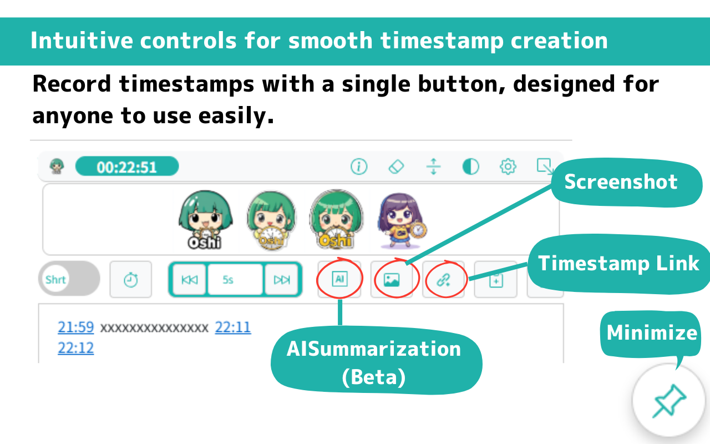

# OSHIStamp: YouTube Video Timestamp Creation Support Tool

[日本語](README.md) | [English](README-EN.md)

A free tool to assist in creating timestamps for YouTube videos.

Not only can you easily create and edit timestamps with intuitive operations, but advanced users can also perform speedy tasks using shortcut keys.

Additionally, you can jump to the corresponding video with a single click from the per-video saved memo list, allowing smooth access to previously created timestamps.

We help make your "Oshi" activities more enjoyable and convenient. Please make use of it!

## Screen Image

## Main Features

- **Insert Timestamps**

  Click the ⏱️ button while watching a video to insert the current time at the cursor position.

- **Change Timestamp Format**

  You can choose between the following two formats for timestamps:

  - Short format (e.g., 2:30, 1:45:15)
  - Full format (e.g., 00:02:30, 01:45:15)

  ※ When adjusting the timestamp using shortcut keys (CTRL + SHIFT/ALT + ↑↓), the selected adjustment interval is applied.

- **Jump from Timestamps**

  Clicking on a timestamp link will move the video to that time.

- **Fast Forward and Rewind**

  You can choose from preset durations (1s, 5s, 10s, 1m, 5m, 10m) using buttons. Shortcut keys (Ctrl + Shift / Alt + ←→) are also supported. One custom duration can be added as well.

- **Video Playback Speed**

  You can choose the playback speed from 0.5x, 1x, 1.5x, 2x, or 2.5x using buttons.

- **AI Summarization (Beta)**

  Leverage Google AI Studio (e.g. Gemini API) to semi‑automatically summarize the content of captioned videos.

  - Limitations
    - Video length: under 12 hours
    - Caption file required
    - Breaks required for continuous use (due to Google AI Studio API rate limits)

- **Video Screenshot**

  You can download a screenshot of the video in "PNG format."

- **Generate Timestamp Links**

  Copy a link that starts playback from the current time to your clipboard with one click.

- **Copy Timestamps**

  You can copy the created timestamps to the clipboard with one click.

- **Check Current Time**

  View the current playback time on-screen in real time.

- **Video-based Auto-Save Function**

  Timestamps are automatically saved to local storage as they are created, so there's no worry about losing data during your work.

  Timestamps are saved independently for each video, allowing you to manage timestamps for multiple videos collectively.Additionally, you can jump to the corresponding video with a single click from the per-video saved memo list, allowing smooth access to previously created timestamps.

- **Backup and Restore**
  To ensure your data is carried over in the following scenarios, we provide a backup feature for timestamp data:

  - Reinstalling the extension
  - Reinstalling Chrome
  - Deleting the user profile (user data directory)
  - Reinstalling the OS or migrating to a different OS

  All timestamp data can be exported/imported in JSON format, making it easy to save and restore your work.

- **Color Mode Feature**

  Now supports Dark Mode.

- **Display Favorite Images**

  By uploading and displaying your favorite images on the screen, you can boost your motivation for "Oshi" activities!
  (Supported size:500px × 70px, formats: JPG, PNG, SVG)

- **Minimize Feature**

  You can minimize the screen to the bottom right when not needed.

## Shortcut Keys（CTRL + SHIFT or ALT）

- **CTRL + SHIFT/ALT + S**: Insert timestamp
- **CTRL + SHIFT/ALT + →**: Skip forward by selected amount
- **CTRL + SHIFT/ALT + ←**: Skip backward by selected amount
- **CTRL + SHIFT/ALT + ↑**: Increase selected timestamp by 1s, 10s, 1m, or 10m (multiple values can be selected)
- **CTRL + SHIFT/ALT + ↓**: Decrease selected timestamp by 1s, 10s, 1m, or 10m (multiple values can be selected)

## Privacy and Data Management

This tool does not collect any user data. All data is stored locally and managed securely.

## Disclaimer

The developer is not responsible for any loss or damage resulting from the use of this tool. Please understand this in advance.

## Privacy

[privacy policy](https://takanori-azegami-jp.github.io/OSHIStamp-docs/README-EN)

## Contact

- [Please contact us here](https://github.com/takanori-azegami-jp/OSHIStamp-docs/issues)

**Supported languages: Japanese, English**

## References

The following site was referenced during the development of this project:

- [piny940 / kokosuko-stamp](https://github.com/piny940/kokosuko-stamp)

---

