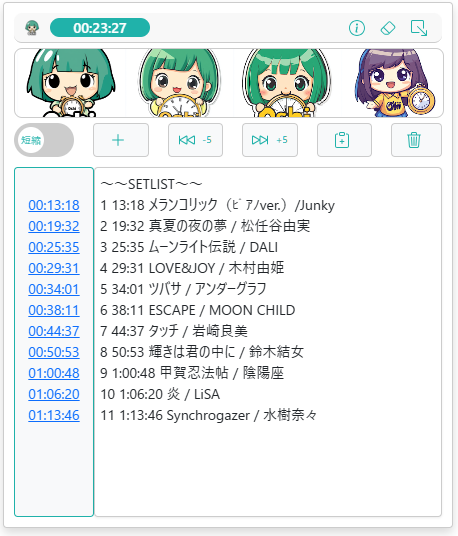

# OSHIStamp（おしスタンプ）：YouTube 動画タイムスタンプ作成支援ツール

YouTube 動画のタイムスタンプ作成を支援する無料ツールです。

直感的な操作で簡単にタイムスタンプを作成・編集できるだけでなく、上級者にはショートカットキーを活用したスピーディーな作業も可能です。

推し活をもっと楽しく、便利にするお手伝いをします。ぜひご活用ください！

## 画面イメージ

## 主な機能

- **タイムスタンプの追加**: 画視聴中に「＋」ボタンをクリックするだけで、現在のタイムスタンプを追加できます。

- **コメントの追加・編集**: 各タイムスタンプに自由にコメントを付けることができます。

- **タイムスタンプからのジャンプ**: タイムスタンプのリンクをクリックすると、動画のその時間に移動できます。

- **推し画像の表示**: 好きな画像をアップロードして画面に表示することで、推し活のモチベーションをアップ！

- **再生時間の確認**: 画面上で動画の再生時間が確認できます。

- **動画の早送り、早戻し**: ボタン操作で 5 秒単位のスキップ、ショートカットキーで 1 秒単位のスキップが可能です。

- **タイムスタンプのコピー**: ワンクリックで作成したタイムスタンプをクリップボードにコピーできます。

- **自動保存機能**: タイムスタンプは自動でローカルストレージに保存されるため、作業中にデータが消える心配はありません。

- **最小化機能**: 必要のないときは、最小化ボタンで画面を右下に収納できます。

## ショートカットキー（上級者向け）

- **CTRL + SHIFT + S** ：タイムスタンプの追加
- **CTRL + SHIFT + →** ：1 秒進む
- **CTRL + SHIFT + ←** ：1 秒戻る
- **CTRL + SHIFT + ↑** ：選択したタイムスタンプを+1 秒調整（複数選択可）
- **CTRL + SHIFT + ↓** ：選択したタイムスタンプを-1 秒調整（複数選択可）
- **CTRL + SHIFT + Enter** ：カーソルがある行のタイムスタンプの時間にジャンプ

## 更新履歴

• バージョン 1.0: 初回リリース。

## プライバシーとデータ管理

本ツールはユーザーのデータを一切収集しません。すべてのデータはローカルに保存され、安全に管理されます。

## 免責事項

本ツールを利用した結果として生じた損失や損害について、開発者は一切の責任を負いかねます。あらかじめご了承ください。

## 問い合わせ

- [お問い合わせは、こちらからお願いします](https://github.com/takanori-azegami-jp/OSHIStamp-docs/issues)

---

