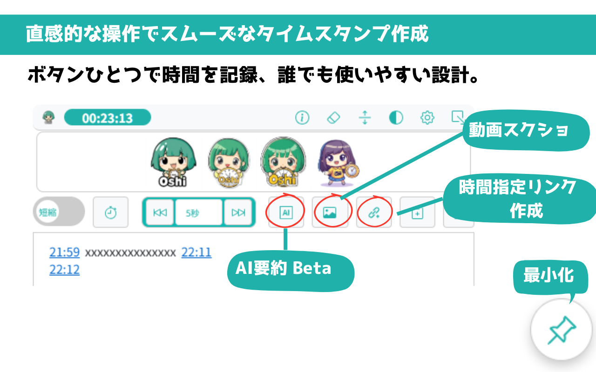

# OSHIStamp（おしスタンプ）：YouTube 動画タイムスタンプ作成支援ツール

[日本語](README.md) | [English](README-EN.md)

YouTube 動画のタイムスタンプ作成を支援する無料ツールです。

直感的な操作で簡単にタイムスタンプを作成・編集できるだけでなく、上級者にはショートカットキーを活用したスピーディーな作業も可能です。

さらに、動画単位の保存メモリストからワンクリックで該当の動画にジャンプできるため、作成済みのタイムスタンプにもスムーズにアクセスできます。

推し活をもっと楽しく、便利にするお手伝いをします。ぜひご活用ください！

## 画面イメージ

## 主な機能

- **タイムスタンプの挿入**

  動画視聴中に「⏱️」ボタンをクリックすればカーソル位置にタイムスタンプを挿入できます。

- **タイムスタンプ形式の変更**

  タイムスタンプは以下の 2 つの形式から選択可能：

  - 短縮形式（例: 2:30, 1:45:15）
  - 完全形式（例: 00:02:30, 01:45:15

  ※ショートカットキー(CTRL + SHIFT/ALT + ↑↓ で ±1 秒の調整する場合も、選択した形式が適用されます。

- **タイムスタンプからのジャンプ**

  タイムスタンプのリンクをクリックすると、該当の再生時間にジャンプします。

- **動画の早送り、早戻し**

  1 秒、5 秒、10 秒、1 分、5 分、10 分からボタンで時間を選択可能。ショートカットキー（Ctrl + Shift / Alt + ←→）にも対応。カスタム時間を 1 つ追加することもできます。

- **AI 要約（ベータ版）**

  Google AI Studio（Gemini API 等）を用いて、字幕付き動画の内容を半自動で要約します。

  - 制限事項

    - 動画長：12 時間未満
    - 字幕ファイル必須
    - 連続利用時は休憩必須（Google AI Studio API のレート制限による）

- **動画のスクリーンショット**

  動画のスクリーンショットを「PNG 形式」でダウンロードできます。

- **動作の再生時間リンクを作成**

  現在の再生時間から始まるリンクを、ワンクリックでクリップボードにコピーできます。

- **タイムスタンプのコピー**

  ワンクリックで作成したタイムスタンプをクリップボードにコピーできます。

- **再生時間の確認**

  画面上で動画の再生時間をリアルタイムで確認できます。

- **動画単位の自動保存機能**

  タイムスタンプは作成と同時にローカルストレージへ自動保存されるため、作業中にデータが失われる心配がありません。

  動画ごとに独立して保存されるので、複数の動画のタイムスタンプをまとめて管理できます。さらに、動画単位の保存メモリストからワンクリックで該当の動画にジャンプできるため、作成済みのタイムスタンプにもスムーズにアクセスできます。

- **バックアップとリストア**

以下のケースでデータを引き継ぐために、タイムスタンプデータのバックアップ機能を提供しています。

    - 拡張機能の再インストール
    - Chrome の再インストール
    - ユーザープロファイル（ユーザーデータディレクトリ）の削除
    - OS の再インストール、または別 OS への移行

全てのタイムスタンプデータは JSON 形式でエクスポート/インポートでき、簡単に保存と復元が可能です。

- **カラーモード機能**

  ダークモードに対応。

- **推し画像の表示**

  好きな画像をアップロードして画面に表示することで、推し活のモチベーションをアップ！
  （対応サイズ: 500px × 70px、形式: JPG, PNG, SVG）

- **最小化機能**

  必要のない時は画面を右下に最小化が可能です。

## ショートカットキー（CTRL + SHIFT または ALT）

- **CTRL + SHIFT/ALT + S** ：タイムスタンプの挿入
- **CTRL + SHIFT/ALT + →** ：選択時間 進む
- **CTRL + SHIFT/ALT + ←** ：選択時間 戻る
- **CTRL + SHIFT/ALT + ↑** ：選択したタイムスタンプを+1 秒調整（複数選択可）
- **CTRL + SHIFT/ALT + ↓** ：選択したタイムスタンプを-1 秒調整（複数選択可）

## プライバシーとデータ管理

本ツールはユーザーのデータを一切収集しません。すべてのデータはローカルに保存され、安全に管理されます。

## 免責事項

本ツールを利用した結果として生じた損失や損害について、開発者は一切の責任を負いかねます。あらかじめご了承ください。

## プライバシー

[プライバシーポリシー](https://takanori-azegami-jp.github.io/OSHIStamp-docs/)

## 問い合わせ

- [お問い合わせは、こちらからお願いします](https://github.com/takanori-azegami-jp/OSHIStamp-docs/issues)

  **対応可能言語：日本語、英語**

## 参考サイト

このプロジェクトの開発にあたり、以下のサイトを参考にさせていただきました。

- [piny940 / kokosuko-stamp](https://github.com/piny940/kokosuko-stamp)

---

