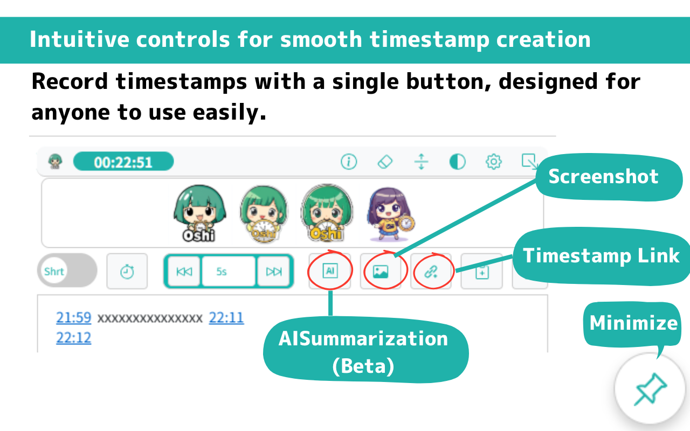

# OSHIStamp: YouTube Video Timestamp Creation & AI Summary Tool

[Japanese](README.md) | [English](README-EN.md)

A free tool to assist in creating timestamps for YouTube videos.

Not only can you easily create and edit timestamps with intuitive operations, but advanced users can also perform speedy tasks using shortcut keys.

Additionally, with the AI summary and the per-video saved memo list, you can jump to the corresponding video with a single click, allowing smooth access to previously created timestamps.

We help make your "Oshi" activities more enjoyable and convenient. Please make use of it!

## Screen Image

## Site URL

- [Chrome extension](https://chromewebstore.google.com/detail/oshistamp-youtube-video-t/hcpfgbneeldjlkbfhbmidhiadhdoddjk)

- [Android app](https://play.google.com/store/apps/details?id=jp.takanoriazegami.oshistamp)

## Privacy Policy

The privacy policy for this application can be found at the following link:

- [Privacy Policy](https://takanori-azegami-jp.github.io/OSHIStamp-docs/Chrome-policy-en.html)

## References

The following site was referenced during the development of this project:

- [piny940 / kokosuko-stamp](https://github.com/piny940/kokosuko-stamp)

---

