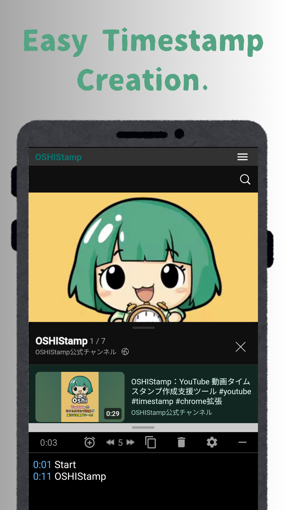

# OSHIStamp: YouTube Video Timestamp Creation Tool

[Japanese](README-android.md) | [English](README-android-en.md)

A free tool that helps you create timestamps for YouTube videos.

Create and edit timestamps easily with intuitive operation.

We help make your fan activities more fun and convenient. Please make use of it!

## Screen Image

## Site URL

- [Google Play Store](https://play.google.com/store/apps/details?id=jp.takanoriazegami.oshistamp)

## Privacy Policy

The privacy policy for this application can be found at the following link:

- [Privacy Policy](https://takanori-azegami-jp.github.io/OSHIStamp-docs/android-policy-en.html)

---

