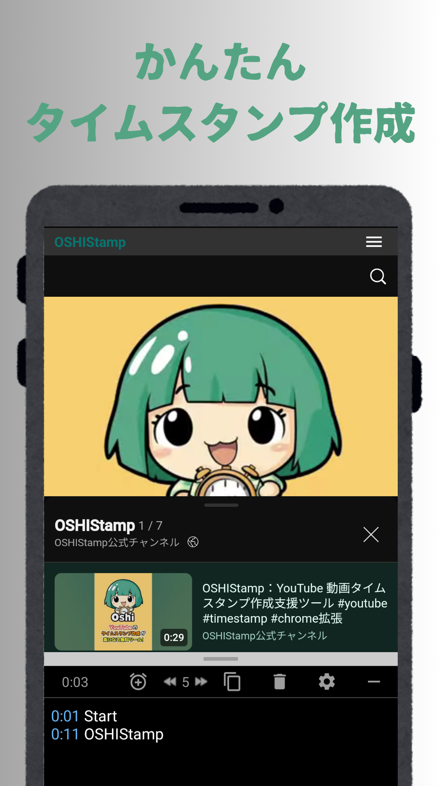

# OSHIStamp（おしスタンプ）：YouTube 動画タイムスタンプ作成支援ツール

[Japanese](README-android.md) | [English](README-android-en.md)

YouTube 動画のタイムスタンプ作成を支援する無料ツールです。

直感的な操作で簡単にタイムスタンプを作成・編集できます。

推し活をもっと楽しく、便利にするお手伝いをします。ぜひご活用ください！

## 画面イメージ

## サイト URL

- [Google Play Store](https://play.google.com/store/apps/details?id=jp.takanoriazegami.oshistamp)

## プライバシーポリシー

本アプリケーションのプライバシーポリシーは、以下のリンクからご確認いただけます。

- [プライバシーポリシー](https://takanori-azegami-jp.github.io/OSHIStamp-docs/android-policy.html)

---

